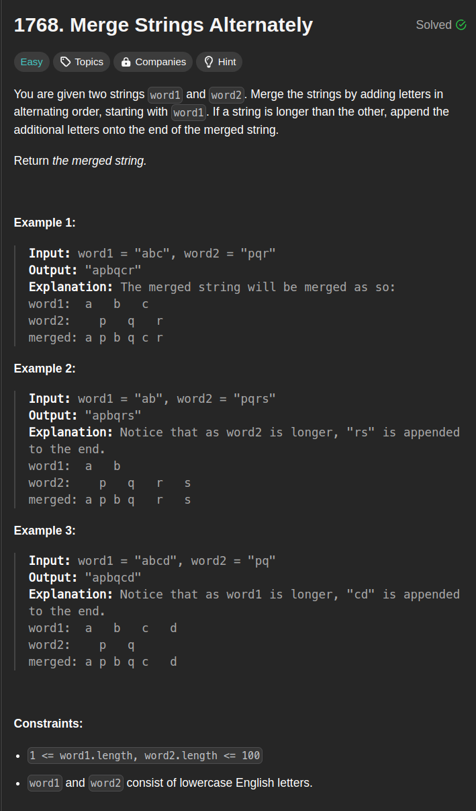

# LeetCode 75 Solved in Java

### 1768. Merge Strings Alternately


**Description:**  
You are given two strings word1 and word2. Merge the strings by adding letters in alternating order, starting with word1. If a string is longer than the other, append the additional letters onto the end of the merged string.

Return the merged string.

<details>
  <summary><b>Explanation (click to expand)</b></summary>
This Java solution effectively merges two strings, word1 and word2, alternately by iterating through both strings and appending characters to the result string until one of the strings is exhausted. The code maintains two pointers, 'i' and 'j', to track the current positions in each string while appending characters alternatively. It utilizes a StringBuilder, 'result', to efficiently construct the merged string. The loop continues until both strings are fully traversed, ensuring the characters are added in an alternating fashion.

</details>
<details>
  <summary><b>Solution in Java (click to expand)</b></summary>

  ```java
  import java.util.Scanner;

  public class Merge_Strings_Alternatively_1768 {

      public static void main(String[] args) {
          Scanner scanner = new Scanner(System.in);
          String str1 = scanner.nextLine();
          String str2 = scanner.nextLine();

          String ans = mergeAlternately(str1, str2);
          System.out.println(ans);
          scanner.close();
      }

      public static String mergeAlternately(String word1, String word2) {
          int i = 0, j = 0;
          StringBuilder result = new StringBuilder();
          int totalLength = word1.length() + word2.length();

          while (i < word1.length() || j < word2.length()) {
              if (i < word1.length()) {
                  result.append(word1.charAt(i++));
              }
              if (j < word2.length()) {
                  result.append(word2.charAt(j++));
              }
          }

          return result.toString();
      }
  }
```

</details>

### 1071. Greatest Common Divisor of Strings


**Description:**
For two strings s and t, we say "t divides s" if and only if s = t + ... + t (i.e., t is concatenated with itself one or more times).

Given two strings str1 and str2, return the largest string x such that x divides both str1 and str2.

<details>
  <summary><b>Explanation (click to expand)</b></summary>
This Java solution finds the largest string 'x' that divides both 'str1' and 'str2'. It checks if the concatenation of 'str1' and 'str2' is equal to the concatenation of 'str2' and 'str1'. If they're not equal, there's no common divisor, and it returns an empty string.

If the concatenations match, the code calculates the GCD of the lengths of 'str1' and 'str2' using the Euclidean algorithm. The GCD represents the length of the largest common divisor string, which is obtained by extracting a substring from 'str1' of length 'gcdLength'.

This method efficiently identifies the largest string that divides both 'str1' and 'str2' by utilizing the GCD of their lengths.

</details>
<details>
  <summary><b>Solution in Java (click to expand)</b></summary>

  ```java
  import java.util.Scanner;

public class Greatest_Common_Divisor_of_Strings_1071 {
    public static String gcdOfStrings(String str1, String str2) {
        if(!str1.concat(str2).equals(str2.concat(str1))){
            return "";
        }

        int gcdLength = gcd(str1.length(), str2.length());

        return str1.substring(0,gcdLength);
    }

    public static int gcd(int num1, int num2){
        return num2 == 0 ? num1 : gcd(num2, num1 % num2);
    }

    public static void main(String[] args) {
        Scanner scanner = new Scanner(System.in);
        String str1 = scanner.next();
        String str2 = scanner.next();
        String result = gcdOfStrings(str1, str2);
        System.out.println(result);
    }
}

```

</details>

### 1431. Kids With the Greatest Number of Candies


**Description:**
There are n kids with candies. You are given an integer array candies, where each candies[i] represents the number of candies the ith kid has, and an integer extraCandies, denoting the number of extra candies that you have.

Return a boolean array result of length n, where result[i] is true if, after giving the ith kid all the extraCandies, they will have the greatest number of candies among all the kids, or false otherwise.

Note that multiple kids can have the greatest number of candies.

<details>
  <summary><b>Explanation (click to expand)</b></summary>
 This Java solution determines if each child, after receiving 'extraCandies', would have the greatest number of candies among all the kids. It initially identifies the maximum number of candies present among the children. Then, it iterates through each child's candies, checking if adding 'extraCandies' to their current count would make them equal to or exceed the highest count. Based on this comparison, it populates a boolean array ('result'), where 'true' signifies a child having the potential greatest candies and 'false' otherwise.

This approach efficiently identifies kids who, after receiving 'extraCandies', could have the maximum number of candies, providing a boolean array indicating their status.

</details>
<details>
  <summary><b>Solution in Java (click to expand)</b></summary>

  ```java
import java.util.*;

public class Kids_With_Greatest_Candies_1431 {
    public static void main(String[] args) {
        Scanner in = new Scanner(System.in);
        int size = in.nextInt();
        int[] arr = new int[size];
        for(int i = 0; i < size; i++){
            arr[i] = in.nextInt();
        }
        int candies = in.nextInt();
        List<Boolean> ans = kidsWithCandies(arr, candies);

        System.out.println(ans.toString());

    }
    public static List<Boolean> kidsWithCandies(int[] candies, int extraCandies) {
        int highest = candies[0];
        for (int i = 1; i < candies.length; i++) {
            if(candies[i] > highest) highest = candies[i];
        }
        List<Boolean> result = new ArrayList<>();
        for (int candy : candies) {
            if (candy + extraCandies >= highest) {
                result.add(true);
            } else {
                result.add(false);
            }
        }
        return result;
    }
}


```

</details>